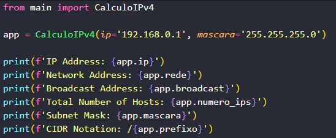
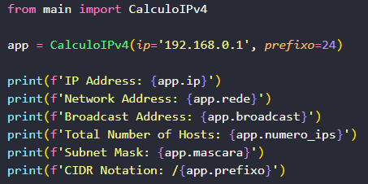

<h1>Cálculo de rede IPV4</h1>

    Enviando o IP juntamente com o CIDR ou a máscara, retorna os seguintes valores: 
    • Endereço de IP • IP da rede • Endereço de Broadcast • Número total de hosts • Máscara • CIDR

<figure>
  
  
</figure>

